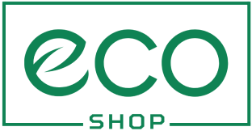
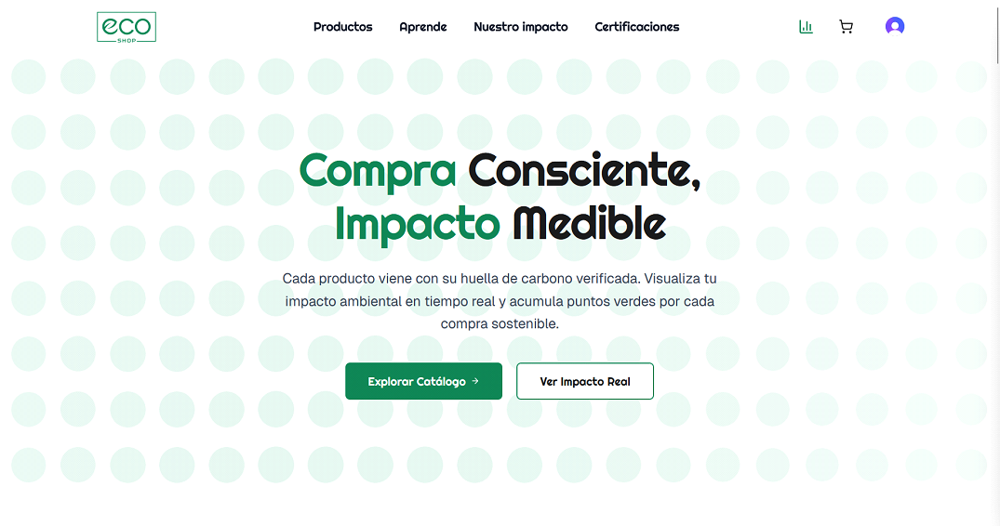
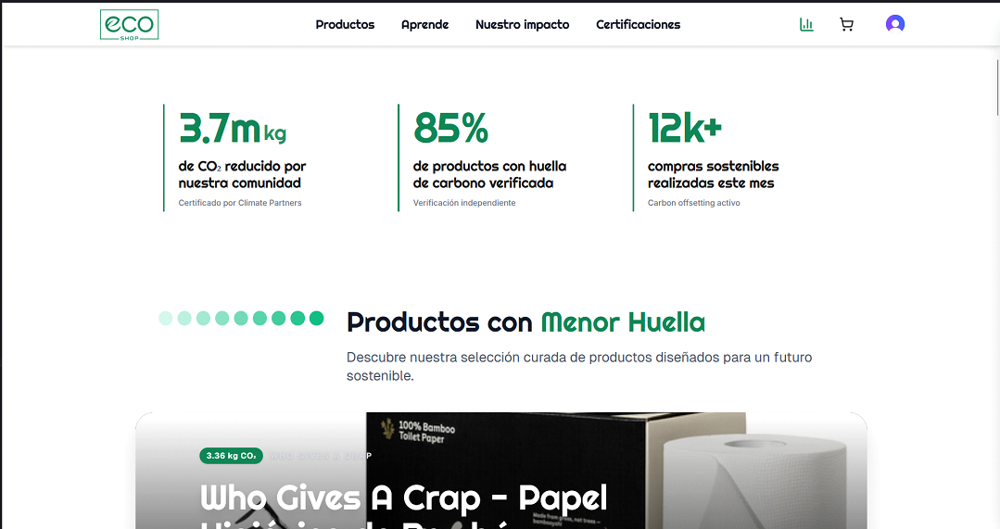
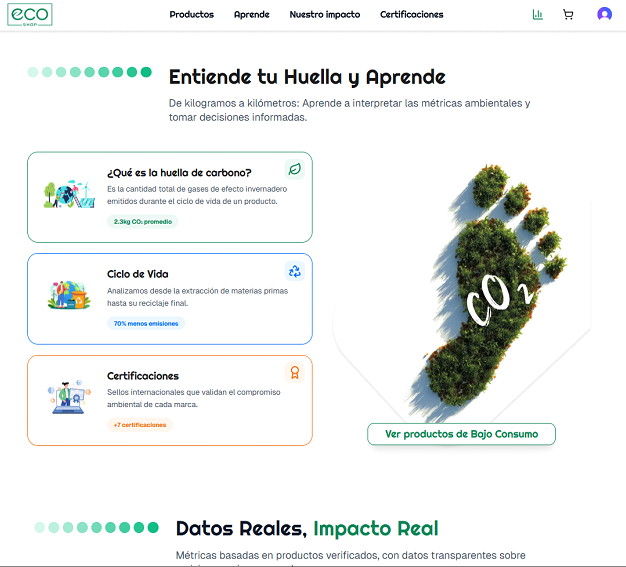
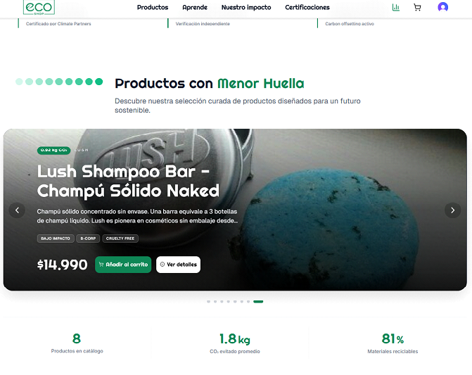
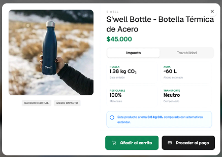
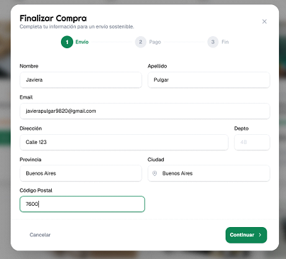
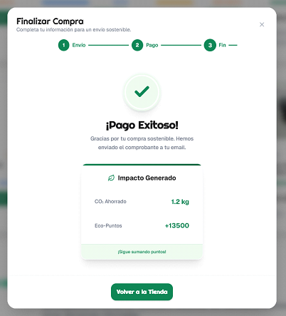
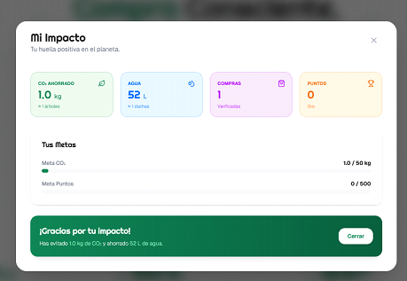

<div align="center">
  
  <h1>EcoShop - Frontend</h1>
  
  <p>
    <b>Tu plataforma de e-commerce consciente.</b><br>
    Comprar es fácil, pero comprar cuidando el planeta es mejor. En EcoShop calculamos la huella de carbono de tus productos y te ayudamos a tomar decisiones sostenibles.
  </p>

  
  
  

 • [Ver Demo](https://youtu.be/pYagnsfvRCs) •
</div>

---

## 📖 Descripción del Proyecto

**EcoShop** nace con la misión de transformar el consumo online en una acción consciente. No solo vendemos productos, vendemos transparencia. Nuestra plataforma calcula en tiempo real la **huella de carbono** de cada artículo, permite compararlo con alternativas industriales y ofrece un **Dashboard de Impacto** donde el usuario puede visualizar sus logros (CO₂ evitado, agua ahorrada) y subir de nivel mediante **Eco-Puntos**.

El proyecto es parte de la simulación laboral seleccionada de **NoCountry** (Equipo 58 - Cohorte s11-25).

---

## 📸 Galería del Proyecto

### 🏠 Experiencia de Usuario
Una interfaz limpia diseñada para educar y vender responsablemente.

| **Home & Propuesta de Valor** | **Métricas de Impacto Global** |
|:---:|:---:|
|  |  |

| **Educación Ambiental** | **Carrusel Destacado** |
|:---:|:---:|
|  |  |

### 🛒 Flujo de Compra Sostenible

**1. Catálogo Inteligente:** Filtros por categoría, precio y **Nivel de Impacto**.


**2. Transparencia Total:** Cada producto muestra su huella de CO₂, agua y trazabilidad.


**3. Checkout & Recompensas:** Proceso de pago fluido con feedback inmediato.
| **Formulario de Envío** | **Pago Exitoso & Eco-Puntos** |
|:---:|:---:|
|  |  |

**4. Tu Huella Personal:** Dashboard para visualizar tus logros ecológicos.


---

## 🛠️ Stack Tecnológico

Construido con la última tecnología para asegurar velocidad, accesibilidad y DX (Developer Experience).

### **Core & UI**
| Tecnología | Badge | Uso |
| :--- | :---: | :--- |
| **Next.js 16** |  | App Router, Server Components. |
| **React 19** |  | Librería de UI moderna. |
| **TypeScript** |  | Tipado estático robusto. |
| **Tailwind CSS v4** |  | Estilos utilitarios de última generación. |
| **Shadcn/UI** |  | Componentes accesibles. |
| **Framer Motion** |  | Animaciones fluidas. |

### **Estado & Data**
| Tecnología | Badge | Uso |
| :--- | :---: | :--- |
| **Zustand** |  | Estado global ligero (Carrito). |
| **TanStack Query** |  | Gestión de datos asíncronos y caché. |
| **Clerk** |  | Autenticación segura. |

---

## 📂 Estructura del Proyecto

Organización modular dentro de `src/` para mantener la escalabilidad.
```bash
ecoshop-frontend/
├── public/              # Activos estáticos (imágenes, fuentes, iconos)
├── src/
│   ├── app/             # Next.js App Router (Rutas y Layouts)
│   │   ├── layout.tsx   # Diseño principal
│   │   └── page.tsx     # Página de inicio
│   │
│   ├── components/      # Biblioteca de componentes UI
│   │   ├── ui/          # Componentes base (Botones, Inputs - Shadcn)
│   │   ├── cards/       # Tarjetas de productos y métricas
│   │   └── sections/    # Secciones grandes (Hero, Carrusel)
│   │
│   ├── contexts/        # Estado global (Zustand)
│   │   └── cart.store.ts
│   │
│   ├── lib/             # Utilidades y funciones auxiliares
│   │   └── utils.ts
│   │
│   ├── providers/       # Proveedores de contexto (Client Components)
│   │
│   ├── services/        # Lógica de conexión con el Backend
│   │   └── api.ts
│   │
│   └── types/           # Definiciones de TypeScript (Interfaces)
│       └── product.ts
│
├── .env.local           # Variables de entorno (No subir al repo)
├── next.config.ts       # Configuración de Next.js
├── package.json         # Dependencias y scripts
└── README.md            # Documentación
```
---

## 👥 Equipo 58 - NoCountry

<table>
  <tr>
  <td align="center" width="200px">
      <a href="https://github.com/NodoLatenteStudio">
        <br />
        <sub><b>Javiera Pulgar</b></sub>
      </a><br />
      <span title="Backend">⚙️ Backend Dev</span><br/>
      <a href="#" target="_blank">LinkedIn</a>
    </td><tr>
    <td align="center" width="200px">
      <a href="https://github.com/SantyGaliano">
        <br />
        <sub><b>Santiago Galiano</b></sub>
      </a><br />
      <span title="UX/UI">🎨 UX/UI Design</span><br/>
      <a href="https://www.linkedin.com/in/santiagogaliano6/" target="_blank">LinkedIn</a>
    </td>
  </tr>
    <td align="center" width="200px">
      <a href="https://github.com/rretta">
        <br />
        <sub><b>Ezequiel Berretta</b></sub>
      </a><br />
      <span title="Frontend">💻 Frontend Dev</span><br/>
      <a href="https://www.linkedin.com/in/ezequiel-berretta/" target="_blank">LinkedIn</a>
    </td>
    <td align="center" width="200px">
      <a href="https://github.com/Tommyx66">
        <br />
        <sub><b>Tomás Zarriello</b></sub>
      </a><br />
      <span title="Frontend">💻 Frontend Dev</span><br/>
      <a href="https://www.linkedin.com/in/tomas-zarriello/" target="_blank">LinkedIn</a>
    </td>
    
  </tr>
  
</table>

---

## ⚙️ Instalación y Configuración Local

Sigue estos pasos para levantar el proyecto en tu entorno local.

### 1. Clonar el repositorio
```bash
git clone https://github.com/Tommyx66/ecoshop-nocountry.git
cd ecoshop-nocountry/frontend
```
### 2. Instalar dependencias
Instala las librerías necesarias para que el proyecto funcione.

```Bash
npm install
# o
yarn install
```
### 3. Configurar Variables de Entorno
Crea un archivo .env.local en la raíz de la carpeta frontend y añade las siguientes claves (solicítalas al equipo si no las tienes):

```bash
# Conexión con el Backend (Render)
NEXT_PUBLIC_API_URL=https://ecoshop-backend-mm8u.onrender.com/api/v1

# Autenticación (Clerk)
NEXT_PUBLIC_CLERK_PUBLISHABLE_KEY=pk_test_...
CLERK_SECRET_KEY=sk_test_...
```

### 4. Ejecutar el servidor de desarrollo
Levanta el proyecto en tu máquina local:
```bash
npm run dev
```
La aplicación estará disponible en http://localhost:3000.

### 🔄 Flujo de Trabajo (Gitflow)
Para mantener el código organizado y evitar conflictos, seguimos estrictamente este flujo:

main: Código de producción estable (lo que ve el usuario final).

develop: Rama de integración principal (donde se juntan los cambios).

feature/nombre-tarea: Ramas temporales para cada nueva funcionalidad (se crean desde develop).

⚠️ Regla de Oro: Todo cambio hacia develop se realiza mediante Pull Request (PR) y requiere la aprobación de al menos un compañero antes de fusionarse.

<div align="center"> <sub>Hecho con 💚 por el <b>Equipo 58</b> para <b>NoCountry</b></sub> </div>
